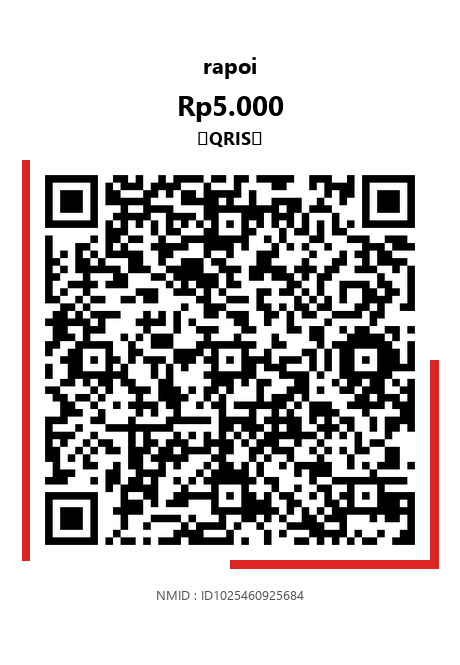
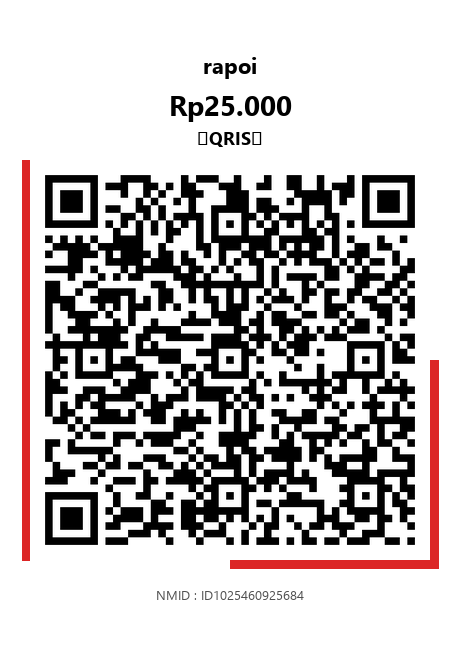
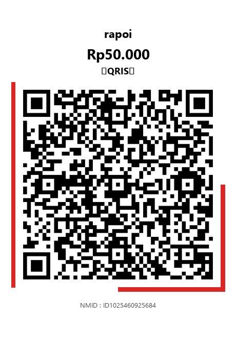
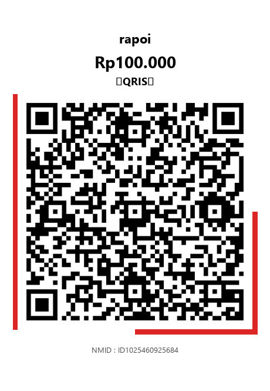

<p align="center">
  
</p>

<p align="center">
  <strong>Generate QRIS QR codes with any nominal amount — no API, no fee, no limit.</strong>
</p>

<p align="center">
  
  
  
  
  
</p>

---

## Apa itu QRIS Generator?

Tool Python yang generate QRIS (Quick Response Code Indonesian Standard) QR codes dengan nominal berapapun. Cukup scan QRIS merchant kamu sekali, terus generate unlimited QR codes.

**Beda harga = beda QR** — karena QRIS Dynamic menyimpan nominal di dalam payload QR-nya.

## Demo

<p align="center">
  
  &nbsp;&nbsp;
  
  &nbsp;&nbsp;
  
  &nbsp;&nbsp;
  
</p>

## Fitur

- **Generate nominal apapun** — dari Rp1 sampai Rp999.999.999
- **Universal** — support 30+ provider Indonesia (DANA, GoPay, OVO, BCA, BRI, Mandiri, dll)
- **Setup wizard** — scan QRIS kamu sekali, tool extract semua data merchant otomatis
- **Multi-profile** — simpan beberapa merchant (warung, restoran, toko, dll)
- **Batch generate** — buat banyak QR sekaligus
- **Decode QRIS** — baca isi payload QRIS apapun
- **Verified** — payload yang di-generate **100% identik** dengan QRIS asli (byte-by-byte)
- **Stylish output** — QR dengan red accents, nama merchant, nominal, dan NMID
- **Zero cost** — gak perlu API, gak perlu bayar, gak perlu daftar

## Instalasi

```bash
# Clone repo
git clone https://github.com/rapoii/qris-generator.git
cd qris-generator

# Install dependencies
pip install pillow qrcode pyzbar
```

> **Windows:** `pyzbar` butuh [zbar DLL](https://github.com/NaturalHistoryMuseum/pyzbar/releases) — download `libzbar-64.dll` dan taruh di folder yang sama atau di PATH.

## Quick Start

### 1. Setup (sekali aja)

```bash
python generate.py setup
```

Tool akan minta kamu scan QRIS merchant kamu:

```
╔══════════════════════════════════════╗
║       QRIS Generator - Setup         ║
╚══════════════════════════════════════╝

Masukkan path gambar QRIS kamu: my_qris.png

✓ QRIS terdeteksi!
  Provider   : DANA
  Merchant   : Warung Kopi Rapoi
  NMID       : ID1025460925684

Simpan sebagai profile: warung
✓ Profile 'warung' tersimpan!

Mau generate QR sekarang? (y/n): y
Masukkan nominal: 25000
✓ QRIS Rp25.000 tersimpan!
```

### 2. Generate QR

```bash
# Single
python generate.py 5000

# Batch
python generate.py 1000 5000 10000 25000 50000

# Pakai profile tertentu
python generate.py --profile warung 25000
```

### 3. Decode QRIS

```bash
python generate.py --decode qris_orang.png
```

```
Payload (207 chars):
  00020101021226570011ID.DANA.WWW...

Parsed:
  Type       : Dynamic
  Provider   : DANA
  Merchant   : Warung ABC
  Amount     : Rp15000
  NMID       : ID1025460925684
  CRC Valid  : True
```

## Command Reference

| Command | Fungsi |
|---------|--------|
| `python generate.py setup` | Setup wizard dari gambar QRIS |
| `python generate.py 5000` | Generate QR Rp5.000 |
| `python generate.py 10k 25k 50k` | Batch generate |
| `python generate.py --decode img.png` | Decode QRIS |
| `python generate.py --list` | List semua profiles |
| `python generate.py --show` | Detail default profile |
| `python generate.py --profile warung 25000` | Pakai profile spesifik |
| `python generate.py --set-default warung` | Set default profile |
| `python generate.py --delete warung` | Hapus profile |
| `python generate.py --payload 5000` | Raw payload only |

## Cara Kerja

QRIS menggunakan standar **EMVCo MPM** (Merchant-Presented Mode). Setiap QR code berisi string TLV:

```
┌──────────────────────────────────────────────────┐
│  Tag 00: Payload Format = 01                      │
│  Tag 01: Initiation = 12 (Dynamic)                │
│  Tag 26: Provider Info (DANA/GoPay/BCA/...)       │
│  Tag 51: QRIS National Info (NMID)                │
│  Tag 54: AMOUNT = 5000  ← INI YG BIKIN BEDA      │
│  Tag 59: Merchant Name                            │
│  Tag 63: CRC-16 Checksum                          │
└──────────────────────────────────────────────────┘
```

**Kenapa beda harga = beda QR?**
- Tag 54 (amount) berubah → string berubah → pola QR berubah
- CRC (Tag 63) auto-recalculate dari payload
- Hanya **4 byte** beda antara Rp5.000 dan Rp10.000 dari total 207 byte

## Supported Providers

| Provider | GUI Identifier |
|----------|---------------|
| DANA | `ID.DANA.WWW` |
| GoPay | `ID.CO.GRABWALKING.WWW` |
| ShopeePay | `ID.CO.SHOOPEE.WWW` |
| OVO | `ID.CO.OCBC.NISP.WWW` |
| BCA | `ID.CO.BCA.WWW` |
| BRI | `ID.CO.BRI.WWW` |
| Mandiri | `ID.CO.BANKMANDIRI.WWW` |
| BNI | `ID.CO.BNI.WWW` |
| CIMB | `ID.CO.CIMBNIAGA.WWW` |
| LinkAja | `ID.CO.LINKAJA.WWW` |
| QRIS Nasional | `ID.CO.QRIS.WWW` |
| ...dan 20+ lainnya | Auto-detected |

## Python API

```python
from qris_gen.core import build_qris_payload, parse_payload, verify_crc
from qris_gen.config import extract_profile_from_parsed, save_profile, load_config
from qris_gen.renderer import render_qris

# Build payload
payload = build_qris_payload(
    amount=25000,
    tag26_raw="0011ID.DANA.WWW...",
    tag51_raw="0014ID.CO.QRIS.WWW...",
    merchant_name="Warung Kopi",
)

# Verify CRC
assert verify_crc(payload)

# Generate image
render_qris(payload, 25000, "Warung Kopi", "ID1025460925684", "output.png")

# Parse any QRIS
parsed = parse_payload(payload)
print(parsed["amount"])       # "25000"
print(parsed["merchant_name"])  # "Warung Kopi"
```

## Struktur Project

```
qris-generator/
├── generate.py              # CLI entry point
├── qris_gen/
│   ├── __init__.py          # Version
│   ├── core.py              # TLV builder + CRC-16 + parser
│   ├── config.py            # Profile management + provider detection
│   └── renderer.py          # QR image generator with styling
├── docs/
│   ├── banner.png           # GitHub banner
│   └── DOCUMENTATION.md     # Full documentation (Indonesian)
├── output/                  # Generated QR images (gitignored)
├── .gitignore
├── LICENSE
└── README.md
```

## Dokumentasi Lengkap

📖 **[DOCUMENTATION.md](docs/DOCUMENTATION.md)** — Instalasi, API reference, EMVCo format, CRC-16 algorithm, FAQ, Contributing guide.

## Kontribusi

1. Fork repo ini
2. Buat branch (`git checkout -b feature/awesome`)
3. Commit (`git commit -m 'Add awesome feature'`)
4. Push (`git push origin feature/awesome`)
5. Open Pull Request

## License

MIT — see [LICENSE](LICENSE) for details.

---

<p align="center">
  <strong>Built with ❤️ in Indonesia</strong><br>
  <sub>QRIS is a registered trademark of Bank Indonesia. This tool is not affiliated with or endorsed by Bank Indonesia.</sub>
</p>
